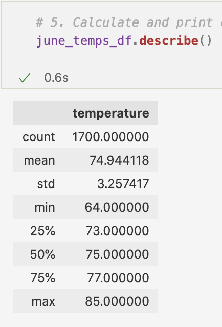
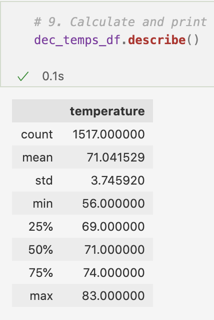

# surfs_up
Analyzing weather for hawaii to determine if investing in Waves &amp; Ice Cream is a smart business decision

## Resources
Software: Jupyter Notebook Version 6.4.6, VS Code Version 1.64.2

Data: [hawaii.sqlite](hawaii.sqlite)

## Overview
The purpose of this analysis is to analyze weather data to determine whether a hypothetical potential shake & surf shop in Oahu can thrive year-round. This analysis will be shown to potential investors so they can invest confidently.

### Analysis Process
After importing dependencies, I used squalchemy to reflect the tables from the database ([hawaii.sqlite](hawaii.sqlite)) and perform queries to retrieve the appropriate data. 

First, I wrote a query to retrieve the Temperatures in June by filtering the on the date column.

```python
june_temps = []
june_temps = session.query(Measurement.date, Measurement.tobs).filter(extract('month',Measurement.date) == 6).all()
```
I was then able to create a DataFrame from this list of temperatures.
```python
june_temps_df = pd.DataFrame(june_temps, columns = ['date','temperature'])
```
Finally, using ```describe()``` I was able to retrieve the summary statistics on this data.

I then completed the same process to retrieve the December temperature by filtering on the data column.
```python
dec_temps = session.query(Measurement.date, Measurement.tobs).filter(extract('month',Measurement.date) == 12).all()
```

Full code can be found at: [SurfsUp_Challenge.ipynb](SurfsUp_Challenge.ipynb)

## Results

### June Temperature Summary Statistics


### December Temperature Summary Statistics


### Differences in Weather between June and December
- The average temperature in Oahu in June is 75° with a standard deviation of 3.25°
- The average temperature in Oahu in December is 71° with a standard deviation of 3.75°
- The minimum temperature in June is 64° vs a minimum temperature of 56° in December
- The maximum temperature in Oahu in June is 85° vs a maximum of 83° in December

## Summary

Overall, the temperatures in Oahu are fairly similar in June and December. December does have a wider range of temperatures (std dev is 3.75° vs 3.25°) with a low of 56°. From this data it appears that December will have more days with weather that is too cold for surfing and ice cream than June will.

Another query that can provide more information for making this decision is to view the precipitaiton data for June and December. Viewing the precipitation data in addition to temperature data can paint a clearer picture of the weather.

Finally, a query on the weather data (temperature and precipitaiton) for June and December from the weather station nearest the proposed surf & ice cream shop location would paint a clearer picture of the weather that most affects the proposed business. 

